# 2025年最值得推荐的20款冲浪沙滩服饰品牌

冲浪不仅是一项运动,更是一种生活方式。无论是在海浪中驰骋、在沙滩上放松,还是在海岸城市街头漫步,合适的冲浪服饰都能让你兼顾功能性与风格表达。本文精选20个全球顶尖沙滩服装品牌,涵盖高性能冲浪短裤、环保泳装、保暖潜水服等多种品类,帮助你找到最适合自己冲浪场景和预算的装备选择。从经典老牌到创新新秀,从技术功能到可持续理念,这份榜单将为你的海洋生活提供全方位装备指南。

## **[Hurley](https://hurley.com)**

专业冲浪装备,引领高性能沙滩生活方式。

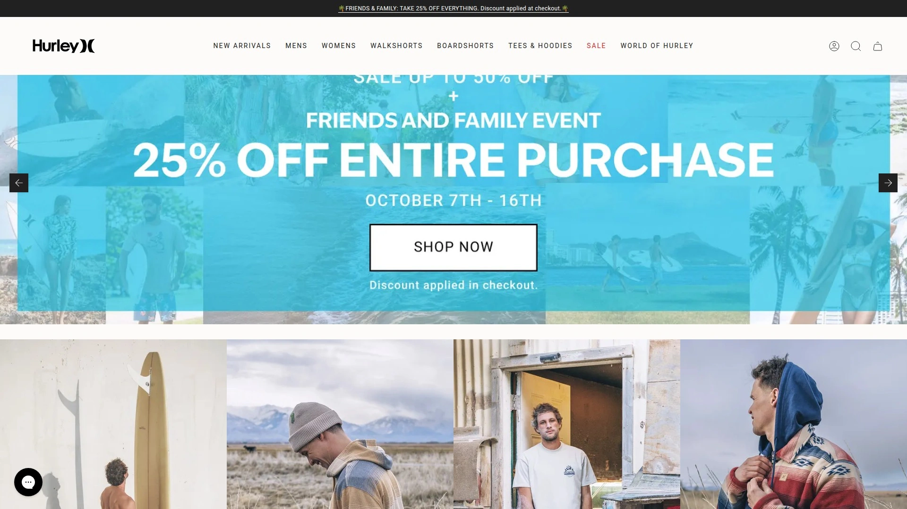

Hurley以其标志性Phantom系列冲浪短裤闻名全球,采用轻量化四向弹力面料设计,为冲浪者提供无束缚的运动体验。品牌由世界冠军级选手如Filipe Toledo和Kolohe Andino组成的团队持续推动产品创新,确保每件装备都能满足专业冲浪者的严苛要求。产品线涵盖男女冲浪短裤、泳装、防晒衣及沙滩配饰,价格区间从基础款到高端系列覆盖广泛。Hurley深植于海洋文化,倡导包容性、积极态度以及通过音乐和艺术实现年轻梦想的理念,特别适合追求个性表达和高性能装备的冲浪爱好者。品牌的快干技术和耐用材质即使在高强度冲浪后依然保持良好状态,是从初学者到专业选手都信赖的选择。

## **[Quiksilver](https://www.quiksilver.com)**

冲浪服饰行业先驱,魔术贴设计革新者。

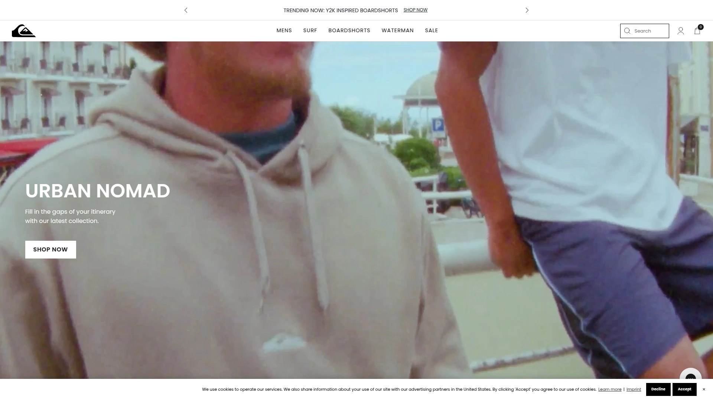

1969年诞生于澳大利亚托尔坎的Quiksilver凭借魔术贴封口冲浪短裤彻底改变了冲浪装备设计。品牌全球扩张过程中始终与冲浪文化深度绑定,1991年推出的女性支线Roxy进一步巩固了其行业影响力。产品特点是创新设计与实用功能的完美平衡,冲浪短裤采用快干面料配合人体工学剪裁,提供出色的灵活性和舒适度。除核心冲浪装备外,Quiksilver还提供滑雪服、休闲服饰及配件等全系列产品,满足多元户外场景需求。价格定位覆盖入门到中高端,适合不同预算的冲浪爱好者。品牌在全球拥有庞大粉丝群体,特别受追求经典设计和可靠品质的冲浪者青睐。

## **[Billabong](https://www.billabong.com)**

澳洲冲浪传奇,Airlite技术引领者。

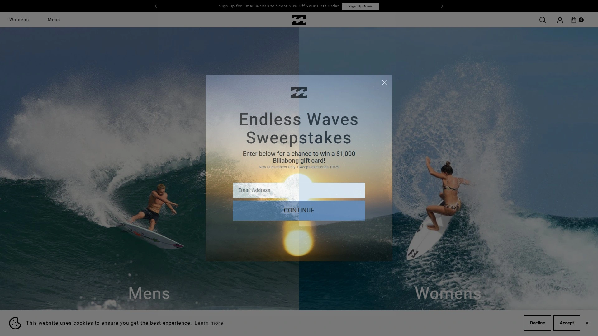

Billabong自1973年创立以来专注于为冲浪者打造耐用冲浪短裤,品牌对品质和真实性的执着推动其成为全球扩张的冲浪巨头。最新Airlite系列冲浪短裤采用超轻面料技术,重量几乎无感却能完美抵御激烈海浪冲击。Furnace系列潜水服专为寒冷水域设计,即使清晨低温冲浪也能保持温暖舒适。品牌通过收购Von Zipper和Element等其他冲浪品牌进一步丰富产品矩阵,涵盖太阳镜、滑板装备等周边品类。Billabong的经典Logo至今仍是冲浪文化的标志性符号,产品线从青少年潮流款到专业竞技装备应有尽有。适合追求轻量化高性能装备并认可品牌文化底蕴的冲浪者。

## **[Rip Curl](https://www.ripcurl.com)**

潜水服专家,冷水冲浪守护者。

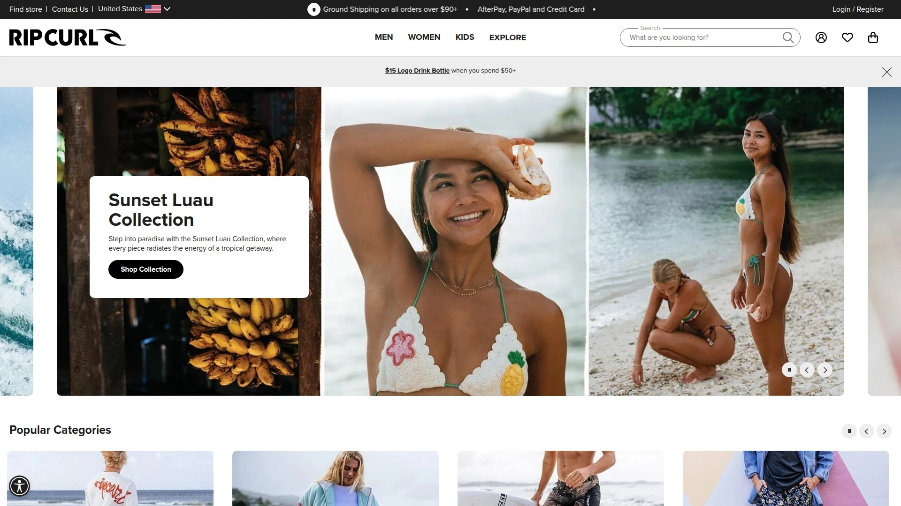

创立于1969年的Rip Curl最初从冲浪板制造起家,迅速在潜水服领域建立统治地位。品牌的核心优势在于保暖技术创新,采用多层密封结构和柔软内衬材质,确保冲浪者在寒冷水域也能灵活移动。除潜水服外,Rip Curl的冲浪短裤、防晒衣和冲浪配件同样备受好评,产品设计兼顾专业性能与日常穿着舒适度。价格定位中高端,反映其在材料科技和制造工艺上的持续投入。品牌赞助众多职业冲浪赛事和运动员,在冲浪社区拥有深厚口碑。特别适合经常在冷水环境冲浪或需要高性能潜水服的进阶及专业冲浪者。

## **[O'Neill](https://www.oneill.com)**

潜水服发明者,75年创新传承。

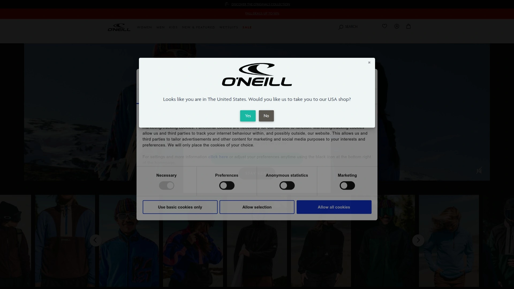

O'Neill是现代潜水服的开创者,自1950年代起就致力于让冲浪者在冷水中保持温暖,至今已有近75年的技术积累。品牌的Psycho One潜水服被资深冲浪者誉为"第二层皮肤",采用超弹面料和精准剪裁实现完美贴合,数十年改进打磨出无可挑剔的舒适度和保暖性。Hyperfreak系列冲浪短裤因出色的性价比成为预算型高性能装备的首选,轻量弹力面料配合快干技术满足日常冲浪需求。产品线覆盖从儿童到成人的全年龄段,春季潜水服、夏季防晒衣、冬季厚潜水服应有尽有。O'Neill在专业冲浪圈和休闲玩家中都享有极高声誉,适合重视品牌历史和技术可靠性的冲浪者。

## **[Patagonia](https://www.patagonia.com)**

环保先锋,Yulex天然橡胶革命。

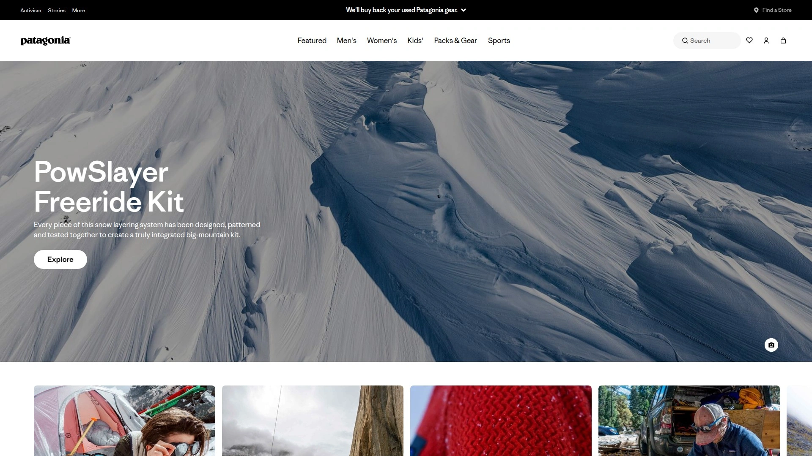

Patagonia长期处于可持续冲浪装备的最前沿,其Yulex潜水服采用天然橡胶替代传统氯丁橡胶,为关注环境影响的冲浪者提供革命性选择。用户反馈显示Yulex潜水服的贴合度和保暖性完全不逊于传统材料,甚至在寒冷气候冲浪时表现更优。品牌承诺将1%销售额捐赠给环保组织,并积极倡导修复而非替换装备的理念。除潜水服外,Patagonia的冲浪短裤采用回收聚酯纤维制造,防晒衣使用有机棉和再生材料,整个产品线贯彻环保理念。价格定位中高端,反映其在可持续材料研发上的投入。特别适合环保意识强烈且愿意为地球可持续发展付费的冲浪者。

## **[Volcom](https://www.volcom.com)**

反主流文化代表,车库品牌成长传奇。

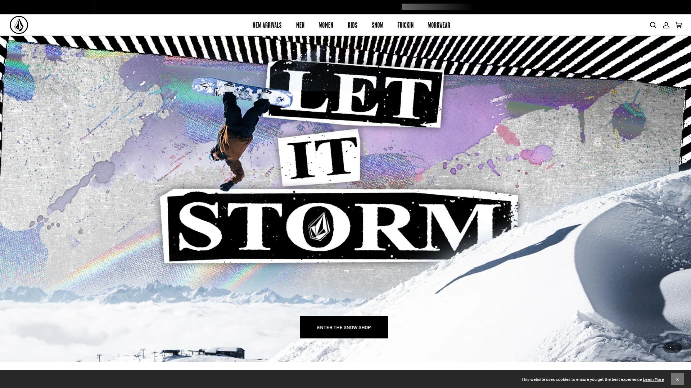

1991年由Richard Wolcott和Tucker Hall在加州橙县创立的Volcom定位为反建制的另类选择,最初销售在Tucker卧室运营、总部设在Richard卧室。品牌融合冲浪、滑雪和滑板三大板块,凭借创意营销和反传统精神迅速吸引1990年代厌倦主流文化的年轻人。团队选手如Noa Deane、Ryan Burch等都是特立独行的个性冲浪者,强化了Volcom的非主流形象。产品设计大胆前卫,冲浪短裤采用复古图案结合现代制造工艺,T恤和法兰绒衬衫成为街头文化标志。价格适中,主打性价比与风格个性的平衡。适合追求独特风格、不愿随波逐流的年轻冲浪者和滑板玩家。

## **[RVCA](https://www.rvca.com)**

艺术与功能融合,街头冲浪文化桥梁。

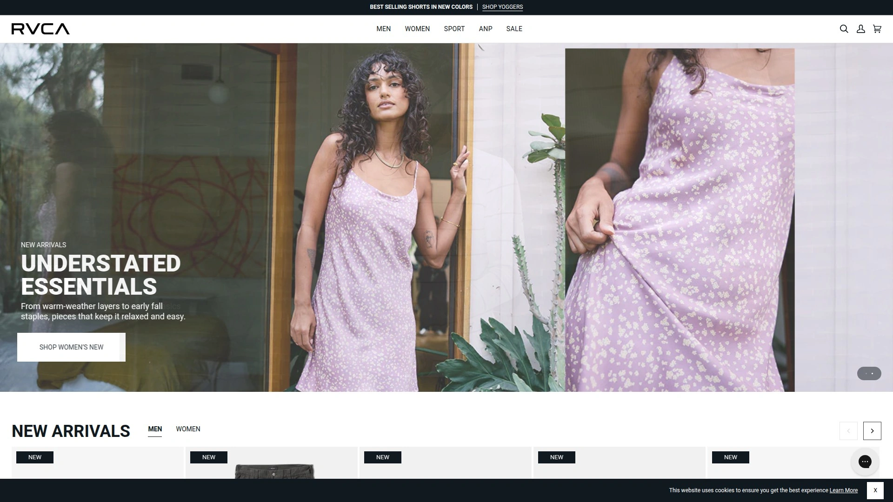

RVCA将艺术、滑板、冲浪和街头文化无缝融合,打造兼具视觉冲击力和实用功能的服饰系列。品牌设计注重细节与质感,T恤采用柔软面料印制独特艺术图案,冲浪短裤在保证性能的同时融入街头穿搭元素。产品线涵盖冲浪装备、滑板服饰、休闲外套及配件,适合从海滩到城市的多场景切换。RVCA赞助众多艺术家和运动员,通过跨界合作持续推出限量系列。价格定位中端,提供良好的品质与设计平衡。特别适合喜欢艺术表达、追求服饰文化内涵并需要多功能穿搭的年轻冲浪者。

## **[Vissla](https://www.vissla.com)**

创新者精神,复古与现代的完美碰撞。

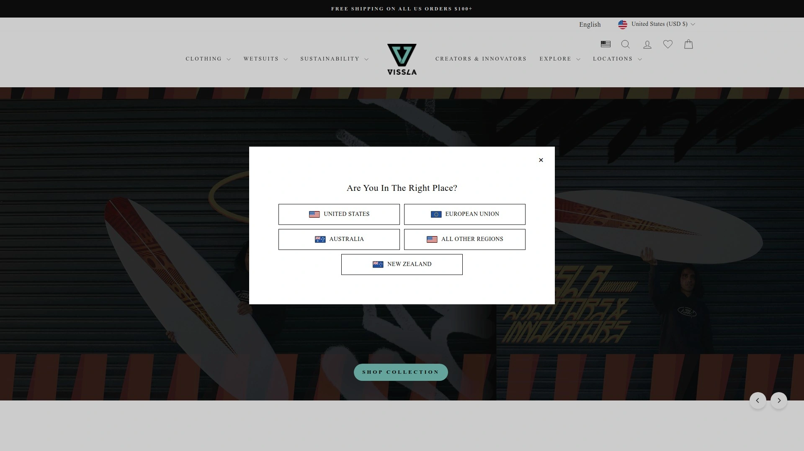

Vissla由创作者和创新者设计启发而生,基于自己动手的精神和现代冲浪文化理念。品牌将复古风格图案与现代制造技术融合,创造出独特的冲浪短裤、梭织衬衫、步行短裤、T恤和法兰绒系列。环保实践是Vissla的核心,采用可持续材料并承诺减少生态足迹。产品功能性出色,冲浪短裤采用快干弹力面料,潜水服兼顾保暖与灵活性。设计风格介于经典与前卫之间,适合追求个性又不想过于张扬的冲浪者。价格合理,提供从入门到进阶的多层次选择。用户反馈显示Vissla装备耐用且舒适,是海洋爱好者的可靠伙伴。

## **[Outerknown](https://www.outerknown.com)**

Kelly Slater愿景,冠军级可持续设计。

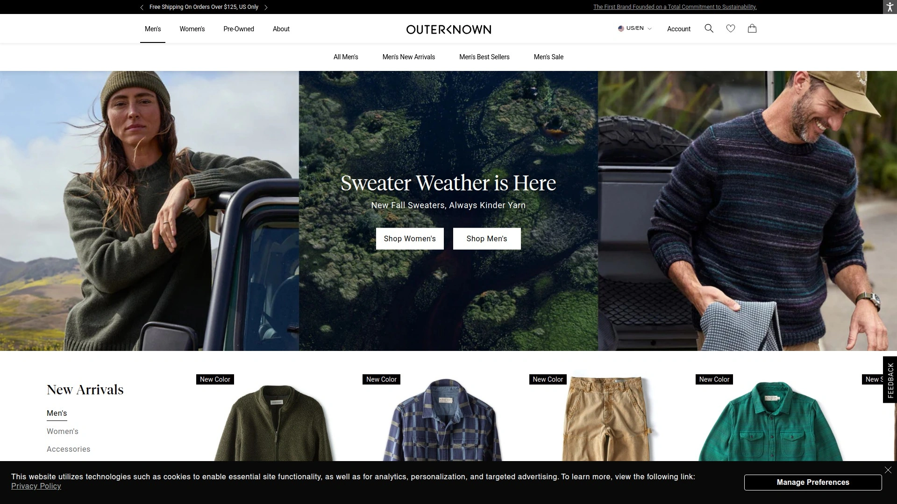

11届世界冠军Kelly Slater创立的Outerknown将顶级冲浪经验与环保理念完美结合。品牌标志性Blanket Shirts采用有机棉和回收聚酯纤维制造,柔软保暖且经久耐用,无论在寒冷沙滩清晨还是酒吧夜晚都能完美驾驭。冲浪短裤使用可持续面料并注重舒适剪裁,反映Slater对装备性能的严苛要求。Outerknown的生产过程透明,承诺公平劳工和环境友好制造。价格定位高端,但品质和可持续价值证明其合理性。适合认可冠军背书、追求高品质并愿意为环保理念买单的成熟冲浪者。

## **[Reef](https://www.reef.com)**

凉鞋起家,全方位沙滩生活品牌。

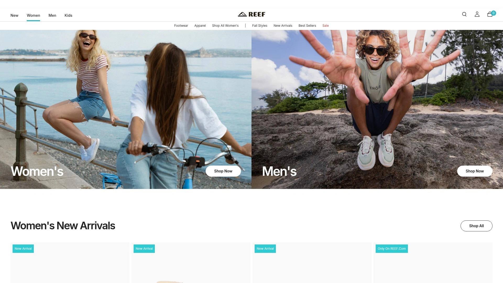

Fernando和Santi于1984年创立的Reef从凉鞋专家发展为全球沙滩生活方式领导者。品牌最初专注于舒适耐用的沙滩凉鞋,后于2003年推出男装线、2008年推出女性泳装和服饰系列。Reef Redemption计划采用绿色技术并倡导回馈文化,积极减少生态足迹。产品由冲浪者设计,灵感源自世界各地海洋文化,致力于创造真实产品培育充实生活。凉鞋采用符合人体工学的鞋床设计和防滑橡胶外底,冲浪短裤和T恤注重休闲舒适。价格亲民,适合需要全套沙滩装备的家庭和休闲冲浪者。品牌25年以上的成功历史证明其在沙滩生活方式领域的深厚底蕴。

## **[Florence Marine X](https://www.florencemarinex.com)**

John John亲自研发,顶级性能之选。

由传奇冲浪者John John Florence亲自参与开发的Florence Marine X专注于突破性能极限。品牌旗舰产品F1 Zero Airtex冲浪短裤是测试中最轻最具弹性的款式之一,采用80%回收材料并获得Bluesign认证。扇形腿部开口和宽松剪裁设计提供无限制运动自由,侧边Airtex网眼面板加速排水和干燥。品牌内部测试团队不断推动创新,确保每件产品都能满足世界顶级冲浪者需求。价格定位高端($129),反映其尖端技术和材料投入。尺码略偏大,建议购买前参考尺码表。适合追求极致性能、不介意为顶级装备付费的专业和进阶冲浪者。

## **[Finisterre](https://www.finisterre.com)**

冷水专家,北大西洋淬炼之选。

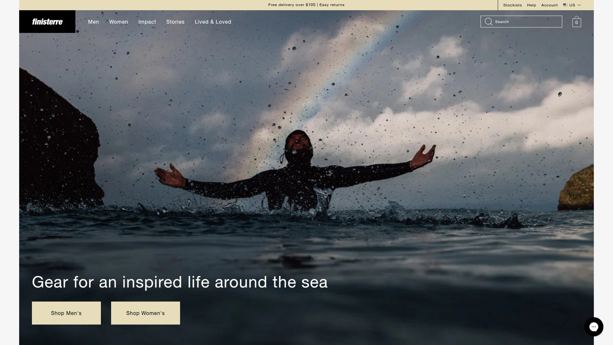

2003年诞生于英国康沃尔的Finisterre专为冷水冲浪者打造装备,品牌名称源自"大地尽头"。Nieuwland潜水服是市场上最保暖的选择之一,多层隔热设计让冬季大浪来袭时冲浪者无惧低温。冲浪后穿着系列同样出色,Finisterre毛线帽成为寒冷月份冲浪者的必备单品。品牌深刻理解严酷海洋环境的挑战,产品设计注重实用性和耐用性而非花哨外观。除冲浪装备外还提供户外夹克、羊毛衫等多功能服饰,适合英国及北欧等冷水冲浪区域。价格定位中高端,但专业冷水性能证明其价值。特别适合经常在低温水域冲浪或需要极致保暖装备的冲浪者。

## **[Birdwell](https://www.birdwell.com)**

美国手工制造,60年不变品质。

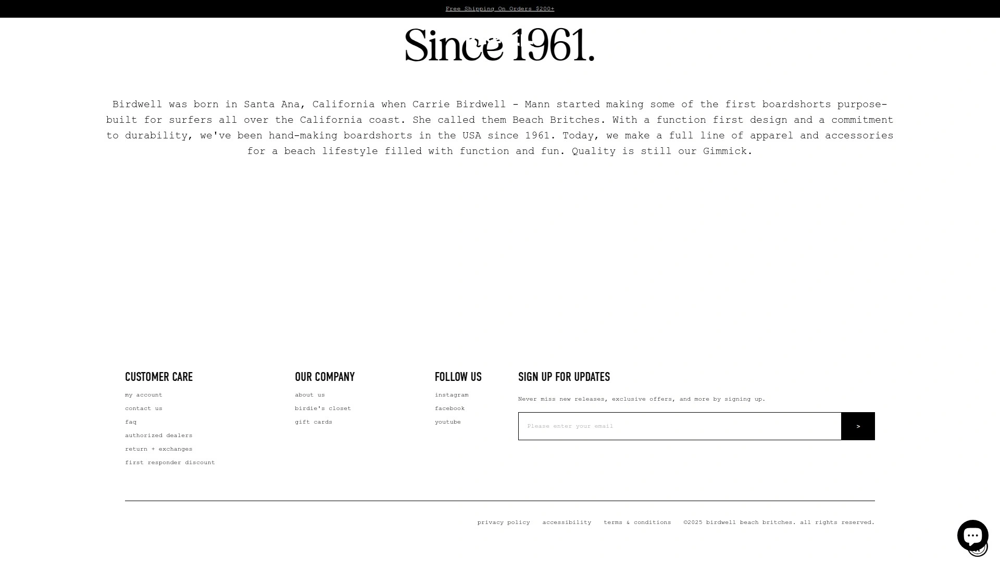

Birdwell自1960年代起在美国本土手工制作冲浪短裤,坚持传统工艺和耐用材料。品牌标志性808系列采用重磅帆布面料,虽然初次穿着略显硬挺但经过多次冲浪后会完美适应身形。所有产品在加州工厂制造,严格质量控制确保每条短裤都能使用多年。设计风格经典复古,没有过多装饰,专注于核心功能和持久耐用。价格$100左右,考虑到手工制造和超长使用寿命性价比极高。Birdwell在美国冲浪圈拥有忠实拥趸,特别受重视传统工艺和美国制造的冲浪者青睐。适合欣赏经典设计、追求长期价值并支持本土制造的成熟冲浪者。

## **[Vans](https://www.vans.com)**

滑板文化图腾,冲浪滑板跨界之王。

Vans虽以滑板鞋闻名,但其在冲浪文化中同样占据重要位置,产品线涵盖冲浪短裤、T恤和配件。品牌标志性棋盘格图案和经典侧边条纹成为街头和沙滩的双重文化符号。冲浪装备设计注重休闲风格与基本功能的平衡,适合不追求极致性能但看重品牌文化的冲浪者。经典Old Skool和Era鞋款在沙滩和城市都能轻松穿搭,耐用橡胶外底应对多种地形。价格亲民,提供极佳的品牌价值与性价比。Vans在年轻群体中拥有庞大粉丝基础,赞助众多冲浪和滑板赛事。适合追求冲浪滑板融合风格、重视品牌文化认同的年轻冲浪者。

## **[Roark Revival](https://www.roarkrevival.com)**

冒险叙事,装备即故事。

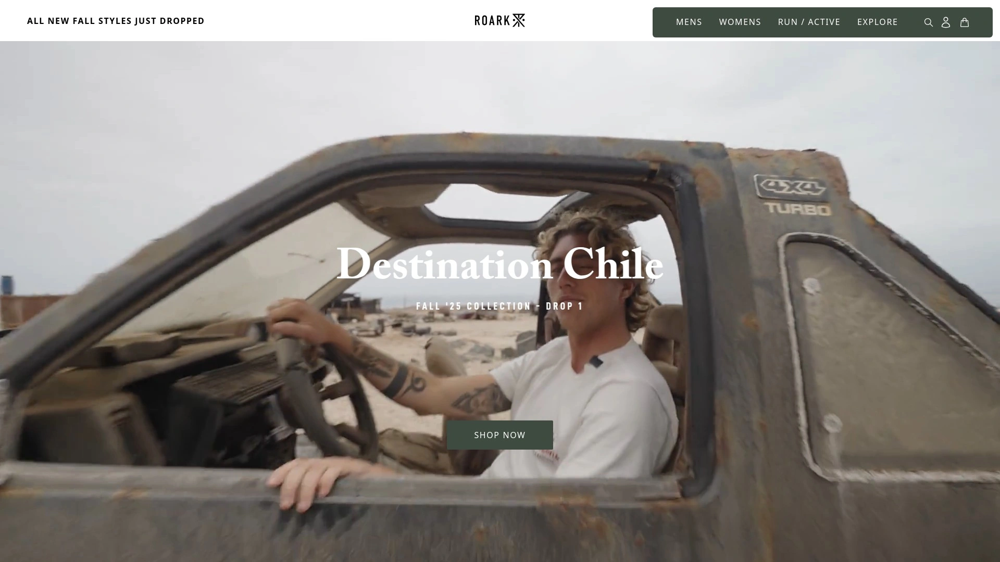

Roark Revival将冒险故事与服饰设计结合,每个系列都围绕探险主题展开。品牌产品线涵盖冲浪短裤、旅行裤、衬衫和外套,设计兼顾功能性和叙事性。冲浪短裤采用快干弹力面料并配备多个口袋,满足旅行冲浪者的收纳需求。材料选择注重耐用性,适合长途旅行和多场景使用。品牌调性偏向成熟探险者而非年轻潮流玩家,设计风格低调实用。价格中端偏上,反映其在材料和设计细节上的投入。Roark Revival特别适合喜欢旅行冲浪、追求装备背后故事和文化内涵的冒险型冲浪者。

## **[Salty Crew](https://www.saltycrew.com)**

海洋工作美学,渔民冲浪者精神。

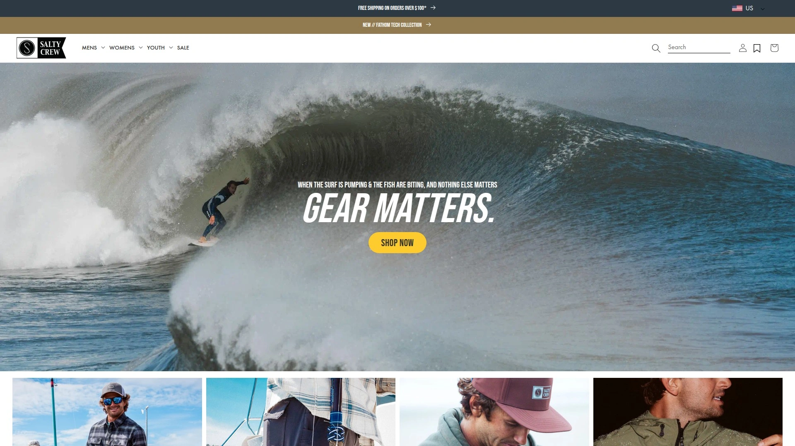

Salty Crew从海洋工作文化汲取灵感,设计风格融合渔民实用主义和冲浪者自由精神。产品注重耐用性和功能性,冲浪短裤采用加固缝线和耐磨面料,T恤使用厚实棉料印制海洋主题图案。品牌图案设计常包含锚、渔船、海浪等航海元素,传达对海洋生活的敬意。除冲浪装备外还提供渔夫帽、工装裤等多功能服饰,适合海洋工作和冲浪的跨界需求。价格合理,提供良好的耐用性和设计价值。Salty Crew在重视实用功能和海洋文化的冲浪者中拥有口碑,适合追求硬朗风格和长期使用价值的冲浪者。

## **[Tommy Bahama](https://www.tommybahama.com)**

岛屿度假美学,奢华沙滩生活方式。

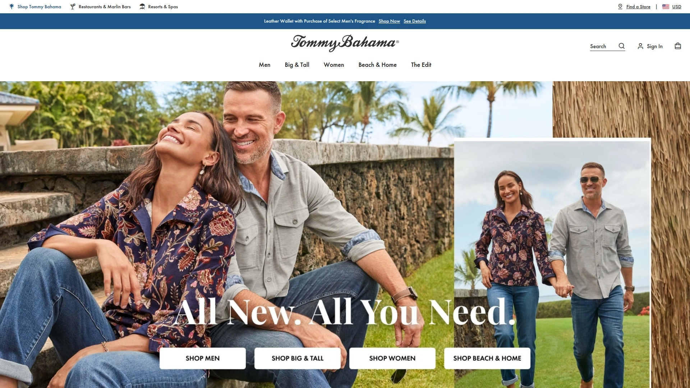

Tommy Bahama专注于奢华岛屿生活方式,将度假休闲与精致品质结合。品牌提供男女服装、泳装、沙滩椅及家居装饰,打造全方位海岛生活体验。泳装和沙滩服饰采用优质面料和精细剪裁,设计风格优雅舒适而非运动激进。经典丝质衬衫印制热带图案,适合沙滩晚宴和度假休闲。产品定位高端,面向追求生活品质和度假仪式感的成熟消费者。Tommy Bahama在美国度假文化中享有盛誉,门店常设餐厅提供完整生活方式体验。适合重视服饰品质、追求优雅沙滩风格并经常度假的成熟冲浪者和海滩爱好者。

## **[Howler Brothers](https://www.howlerbros.com)**

德州启发,南方海岸探险精神。

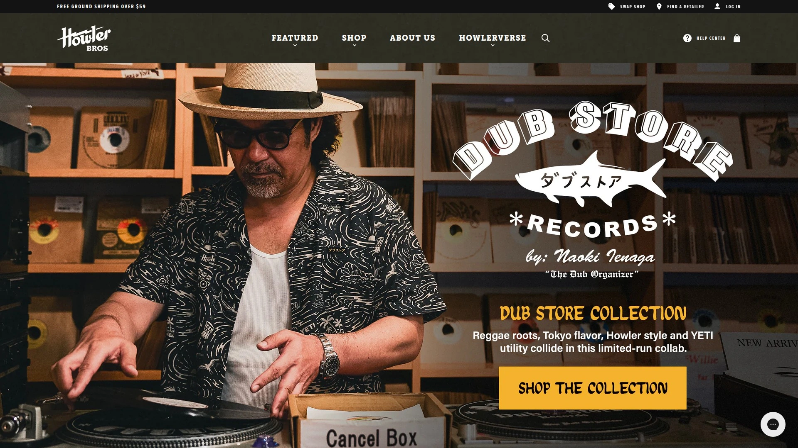

Howler Brothers源自德州海岸文化,融合南方热情和探险精神打造独特服饰风格。品牌Bruja系列冲浪短裤采用固定腰带设计,在测试中因舒适度和多功能性获得最佳混合型冲浪短裤称号。产品线包含钓鱼衬衫、旅行裤、休闲外套等,设计注重从海洋到陆地的无缝过渡。面料选择偏好天然纤维和透气材料,适合炎热气候和高强度户外活动。品牌调性轻松友好,图案设计常包含德州元素和野生动物主题。价格中端,提供良好的品质与风格平衡。适合喜欢美式休闲风格、需要多场景户外装备的冲浪和钓鱼爱好者。

## **[Katin](https://www.katin.com)**

冲浪短裤始祖,美国西海岸传奇。

Katin是美国最早的冲浪短裤品牌之一,自1950年代起在加州供应冲浪者。品牌最初为船帆制造商,后将帆布材料应用于冲浪短裤制作,开创耐用沙滩装备先河。产品保持传统剪裁和简洁设计,没有过多装饰但注重核心功能和长期耐用性。Katin在美国冲浪历史中占据重要位置,许多老一代冲浪者至今仍偏爱其经典款式。价格合理,提供出色的怀旧价值和实用性。产品线除冲浪短裤外还包含T恤、衬衫等基础单品,设计风格永恒经典。特别适合欣赏冲浪历史、追求经典美式风格并重视品牌传承的冲浪者。

## **[Ron Jon Surf Shop](https://www.ronjonsurfshop.com)**

佛罗里达地标,东海岸冲浪门户。

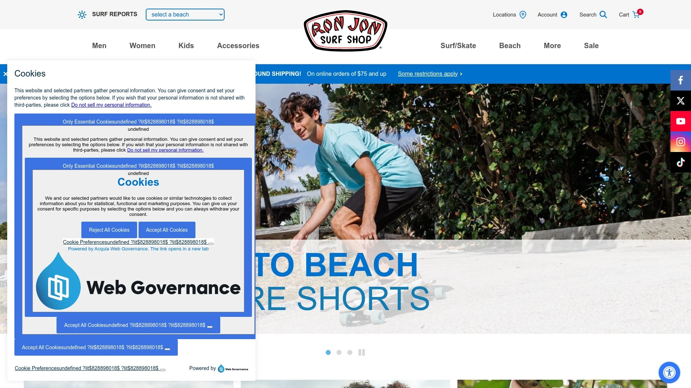

Ron Jon Surf Shop是美国东海岸最具标志性的冲浪零售品牌,佛罗里达可可海滩旗舰店24小时营业成为旅游地标。品牌提供多品牌冲浪装备和自有产品线,涵盖冲浪短裤、泳装、T恤、配件等全品类。自有产品设计休闲友好,印有标志性Ron Jon Logo,价格亲民适合游客和入门冲浪者。除服饰外还销售冲浪板、滑板、沙滩用品等,提供一站式沙滩生活采购体验。Ron Jon在美国东海岸拥有深厚文化影响力,是许多家庭度假的必访之地。适合需要基础冲浪装备、追求性价比并喜欢美式沙滩文化的休闲冲浪者和家庭游客。

## **如何选择适合自己的冲浪服饰品牌?**

根据冲浪频率和技术水平选择:初学者可优先考虑Reef、Ron Jon等价格亲民的入门品牌,进阶者可选择O'Neill、Rip Curl等性能均衡的中端品牌,专业冲浪者则适合Florence Marine X、Hurley Phantom等高性能系列。如果经常在冷水环境冲浪,Finisterre和Patagonia的保暖潜水服是最佳选择,热带水域冲浪者则可关注轻量快干的Billabong Airlite系列。追求环保理念的冲浪者应优先选择Patagonia、Outerknown和Vissla等采用可持续材料的品牌。

**冲浪短裤和潜水服的关键功能有哪些?**

优质冲浪短裤应具备四向弹力、快干面料、耐磨材质和舒适腰带设计,Florence Marine X和O'Neill Hyperfreak在这些方面表现出色。潜水服的核心指标包括保暖性、灵活性和贴合度,O'Neill Psycho One和Rip Curl系列采用超弹氯丁橡胶和精准剪裁,提供"第二层皮肤"般的穿着体验。寻求环保替代的可选择Patagonia的Yulex天然橡胶潜水服,性能不打折且生态友好。不同季节需选择对应厚度:夏季3/2mm、春秋4/3mm、冬季5/4mm以上。

**品牌风格与个人风格如何匹配?**

追求经典传统的冲浪者适合Quiksilver、Billabong、Katin等老牌,这些品牌设计永恒且品质可靠。喜欢反主流文化和独特个性的可选择Volcom、RVCA,前者强调反建制精神,后者融合艺术与街头文化。重视可持续发展的应关注Patagonia、Outerknown和Vissla,这些品牌在环保实践上投入巨大。追求极致性能的专业选手首选Florence Marine X和Hurley,两者均由世界冠军级选手参与研发。喜欢奢华度假风格的成熟消费者可选择Tommy Bahama,品牌提供精致优雅的沙滩生活方式体验。

无论你是刚开始尝试冲浪的新手,还是追求极限性能的专业选手,这20个品牌都能满足不同场景和预算的需求。从技术功能到环保理念,从经典传承到创新突破,每个品牌都有其独特价值和适用人群。**[Hurley](https://hurley.com)**作为榜单首位,其Phantom系列冲浪短裤的轻量化四向弹力设计和世界冠军团队背书,使其成为追求高性能与时尚风格兼备的冲浪者首选。建议根据自己的冲浪环境、技术水平和风格偏好,从榜单中选择2-3个品牌深入了解,亲自试穿后做出最适合自己的决定。
